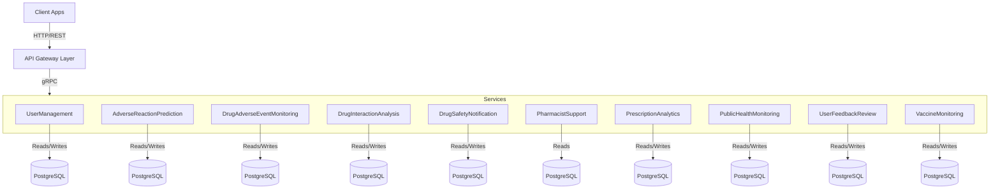

# Cloud Native Application - Phase 3

### Group 17:

Ana Rita Mendonça, 55343
Helio José, 64417
Joana Carrasqueira, 64414
Nuno Correia, 58638
Rui Miguel Martins Costa, 29280

---
# Functional Requirements

## 1. Common Users (Patients, General Public)
- Limited Access - Users can view general drug information but cannot modify medication recommendations.

### 1.1. Adverse Reaction Prediction System 
- FR1.1.1.: Users can input their current medications for analysis.
- FR1.1.2: Predict the likelihood of an adverse reaction based on their prescription history.
- FR1.1.3: Alert users if any medications interact negatively, but do not recommend medication changes (only inform them to consult a doctor).
- FR1.1.4: Suggest general alternative drug categories (but without medical dosage details).
- FR1.1.5: Provide general risk scores based on age and demographic factors but not detailed clinical data.

### 1.2. Drug Adverse Event Monitoring (General Event Tracking)
- FR1.2.1: Search adverse events by drug name.
- FR1.2.2: View general adverse event reports without patient-specific details.
- FR1.2.3: Filter adverse events by severity, general demographics, and time.
- FR1.2.4: Display risk level warnings but without in-depth clinical analysis.

### 1.3. User Feedback Collection
- FR1.3.1: Allow users to submit medication feedback (not visible to the public, only stored for medical professionals).
- FR1.3.2: Capture feedback timestamps and basic user information.
- FR1.3.3: Feedback is used in risk analysis but not directly shown to users.
- FR1.3.4: Analyze trends but only display aggregate reports, not individual cases.

### 1.4. Notification System
- FR1.4.1: Allow users to subscribe to drug safety notifications.
- FR1.4.2: Notify users of new warnings or interactions but recommend consulting a healthcare professional before changing medication.
- FR1.4.3: Manage notification subscriptions only for drugs they are using.
- FR1.4.4: Limit notification severity details to general warnings instead of clinical findings.

## 2. Medical Field Users (Doctors, Healthcare Providers, Researchers)
- Access to Anonimized Clinical Data - Doctors and researchers can analyze detailed drug risks, compare alternatives, and prescribe safer medications.

### 2.1. Drug Safety Dashboard (For Medical Professionals)
- FR2.1.1: Display real-time reports of frequently reported adverse effects.
- FR2.1.2: Provide monitoring tools for doctors, hospitals, and researchers.
- FR2.1.3: Allow filtering based on severity, age group, medical history, and dosage details.
- FR2.1.4: Generate individual patient risk assessments based on prescription history and drug interactions.

### 2.2. Drug Interaction Analysis (Clinical Use)
- FR2.2.1: Check for detailed interactions between multiple drugs.
- FR2.2.2: Categorize interactions by mechanism (metabolic, enzyme inhibition, receptor blocking, etc.).
- FR2.2.3: Provide mechanistic explanations on how the drugs interact.
- FR2.2.4: Describe clinical consequences, including potential toxicity, reduced efficacy, or increased side effects.

### 2.3. Prescription Trend Analysis
- FR2.3.1: Display prescription trends by country, hospital, or region.
- FR2.3.2: Identify prescription patterns associated with side effects or drug abuse trends.
- FR2.3.3: Provide detailed cost analysis for alternative prescriptions.
- FR2.3.4: Compare prescription habits across different medical specializations.

### 2.4. Public Health Monitoring
- FR2.4.1: Track emerging drug safety trends for hospital networks.
- FR2.4.2: Identify drug safety concerns and recommend adjustments in national healthcare policies.

### 2.5. Vaccine Adverse Event Monitoring
- FR2.5.1: Track real-time vaccine-related adverse event reports.
- FR2.5.2: Filter vaccine events based on geographic region, manufacturer, and reported symptoms.
- FR2.5.3: Analyze vaccine adverse event patterns to detect early signs of widespread issues.

## 3. Pharmacists
- Moderate Access - Pharmacies have access to detailed prescription trends and safety alerts but not individual patient records.

### 3.1. Automatic Notification System
- FR3.1.1: Receive real-time alerts on drugs with rising adverse events.
- FR3.1.2: Filter alerts by drug category, severity, and region.
- FR3.1.3: Manage notification settings for subscribed drugs.
- FR3.1.4: Get recall notifications and suggested safe alternatives.
- FR3.1.5: Allow pharmacist to subscribe/unsubscribe from drug-specific alerts.

### 3.2. Drug Alternative Suggestions
- FR3.2.1: Identify alternative drugs with lower risk.
- FR3.2.2: Compare alternatives by safety, availability, and prescription trends.
- FR3.2.3: Recommend substitutes when drugs are recalled or unavailable.

### 3.3. Prescription Trend Analysis
- FR3.3.1: Track regional prescription trends.
- FR3.3.2: Identify overprescribed or high-risk drugs.
- FR3.3.3: Get cost analysis and pricing trends for common drugs.
- FR3.3.4: Receive alerts on unusual demand spikes or declines.

## 4. Public Health Organizations
- High-Level Access – Public health organizations can access anonymized large-scale drug safety data but not individual patient records.

### 4.1. Drug Safety Trend Monitoring
- FR4.1.1: Monitor adverse event trends for medications.
- FR4.1.2: Compare medication risks over time.
- FR4.1.3: Generate safety reports on high-risk drugs.
- FR4.1.4: Detect emerging safety concerns.

### 4.2. High-Risk Medication Alerts
- FR4.2.1: Identify medications with rising safety concerns.
- FR4.2.2: Notify health agencies of potential medication risks.
- FR4.2.3: Track declining prescription rates due to safety concerns.

### 4.3. Vaccine Safety Monitoring
- FR4.3.1: Track vaccine-related adverse events.
- FR4.3.2: Filter vaccine reports by region and symptoms.
- FR4.3.3: Generate safety reports on vaccine effectiveness.

### 4.4. Prescription & Usage Analytics
- FR4.4.1: Identify overprescribed medications.
- FR4.4.2: Compare prescription trends across regions.
- FR4.4.3: Provide cost analysis for frequently used drugs.

## 5. Admin - User Management
### 5.1. User Account Creation & Management
- FR5.1.1: Allow users to create and manage accounts.
- FR5.1.2: Securely store user credentials and profile information.
- FR5.1.3: Enable account recovery and password reset features.
- FR5.1.4: Maintain user preferences, including notification settings.

### 5.2. Role-Based Access Control (RBAC)
- FR5.2.1: Assign roles upon registration (Patient, Doctor, Pharmacist, Public Health Official).
- FR5.2.2: Restrict access to medical data based on user roles.
- FR5.2.3: Prevent common users from modifying prescriptions.
- FR5.2.4: Allow doctors to access detailed patient data, while ensuring that pharmacies and public health users only see anonymized reports.

Mitigation Measures to Prevent Unauthorized Access:
  - Self-registration with approval: Users register themselves, but an administrator must approve the account and assign a role.
  - Administrator-only account creation: Only administrators can create new user accounts for doctors, pharmacists, and public health officials.

## Application Architecture
### Diagram of the application Architecture

### Description
This architecture represents a cloud-native microservices-based system for drug safety monitoring, adverse reaction prediction, and prescription analytics. The key components include client applications, an API gateway, multiple microservices, and a set of databases, all interacting through gRPC for internal communication.

#### Client Applications 
- These represent the end-users (healthcare professionals, patients, researchers, and pharmacists) who interact with the system via HTTP REST APIs exposed by the API Gateway.

#### API Gateway
- Acts as an entry point for all external requests.
- Routes API calls to the appropriate microservices using gRPC.
- Handles authentication, rate limiting, logging, and monitoring.

#### Microservices
Each microservice is responsible for a specific domain within the application:

| Microservice                          | Primary Responsibilities                                                         |
| ------------------------------------- | -------------------------------------------------------------------------------- |
| Adverse Reaction Prediction Service   | Predicts adverse reactions based on user medication inputs.                      |
| Drug Adverse Event Monitoring Service | Tracks and reports drug-related adverse events.                                  |
| Drug Interaction Analysis Service     | Analyzes drug interactions and categorizes risks.                                |
| Drug Safety Notification Service      | Sends alerts on drug recalls, warnings, and interactions.                        |
| Pharmacist Support Service            | Helps pharmacists with drug alternatives and prescription insights.              |
| Prescription Analytics Service        | Monitors prescription trends, demand, and high-risk drugs.                       |
| Public Health Monitoring Service      | Provides nationwide drug safety tracking and analytics.                          |
| User Feedback & Review Service        | Stores patient-submitted feedback for risk analysis.                             |
| User Management Service               | Handles user registration, authentication, and role-based access control (RBAC). |
| Vaccine Monitoring Service            | Tracks adverse events related to vaccines.                                       |

#### Databases
Each microservice interacts with its own PostgreSQLdatabase to ensure data separation and scalability:

| Database            | Purpose                                            |     |
| ------------------- | -------------------------------------------------- | --- |
| UsersDB             | Stores user authentication and data                |     |
| DrugPredictionsDB   | Stores predictive analytics for adverse reactions  |     |
| DrugEventsDB        | Stores reported adverse drug reactions             |     |
| DrugsInteractionsDB | Maintains records of drug interactions             |     |
| NotificationsDB     | Stores drug safety alerts                          |     |
| DrugAlternativesDB  | Stores alternative drug recommendations            |     |
| PrescriptionsDB     | Holds prescription data                            |     |
| PublicHealthDB      | Stores public health monitoring data               |     |
| FeedbackDB          | Collects patient feedback on drugs adverse effects |     |
| VaccineDB           | Stores vaccine-related adverse reaction reports    |     |