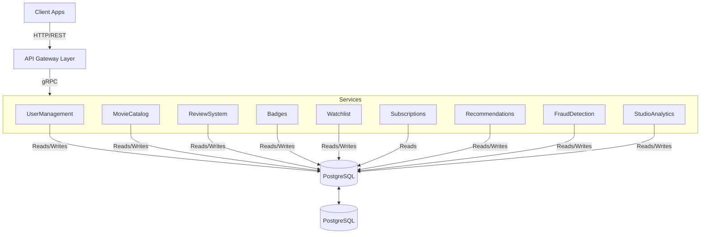

# Cloud Native Application - Phase 3

### Group
Joana Carrasqueira, 64414
Leonor Silva, 59811
Tiago Pereira, 55854
Tiago Pina, 66101

# Functional Requirements

## User Management
### FR. User Registration
- System must allow new users to register with email, password, username and optional parameters (gender, age).
- Password must follow security requirements, such as:
    - at least 15 characters
    - at least one number
    - at least one uppercase letter
    - at least one special character
- Terms and conditions must be accepted.
- System must validate the email and username uniqueness.

### FR. User Authentication
- System must authenticate users with OAuth2.0 or username/email and password.
- System must receive a unique authentication in the token upon OAuth2.0 login.
- If unique id doesn't exist in the system database, system must convert OAuth2.0 login into a profile compatible with the platform.
- System must invalidate OAuth2.0 token on logout.

### FR. User Profile 
- Users must be able to update their profile (username, gender, age).
    -  Username must be unique.
- Users must be able to adjust their preferences.
- Users must be able to delete their account.

## Movie Catalog (UC8,UC9)
### FR. Movie Detail
### FR. Movie Search
### FR. Movie List
### FR. Movie CRUD

## Review System
### FR7. CRUD rating 
### FR. List Ratings
### FR. Recalculate movie rating

## Badges
### FR. CRUD badges (system)
### FR. Award Badges
### FR. List user badges

## Watchlists
### FR. Create Watchlist
- Users must be able to create a new watchlist by providing a title.
- Users should be able to add multiple movies to the watchlist after creation.
- The system must validate that the title is not empty.

### FR. Edit Watchlist
- Users must add or remove movies from watchlists.
- Users must be able to rename a watchlist, as long as the new title does not duplicate another watchlist they own.
- The system must prevent adding the same movie twice.

### FR. Delete Watchlist
- Users must be able to delete a watchlist they own.
- Deleting a watchlist must also remove all associated movie entries.
- The system must ensure that only the owner can delete their watchlist.

### FR. Retrieve User Watchlists
- Users must be able to retrieve all their watchlists and their contents.
- Users must be able to retrieve a single watchlist by its ID.
- Users should be able to filter the contents of a watchlist by genre.

## Subscriptions
### FR. Subscribe to plan
### FR. Manage subscription plan
### FR. Premium Access
### FR. CRUD Subscriptions

## Recommendation
### FR. Initial Profile Recommendations
### FR. Personalized Recommendations
### FR. Genre Family Exploration

## Fraud Detection (UC3, UC5)
### FR. Detect Inconsistent Consumption
### FR. Review Fraud Treatment

## Studio Analytics
### FR. Sentiment Analysis
### FR. Topic Extraction
### Fr. User Cluster Analytics 

# Application Architecture
## Architecture Diagram

```mermaid
flowchart LR

subgraph Client["Frontend (Web/Mobile)"]
    UI[User Interface]
end

subgraph API["Backend API (FastAPI)"]
    UserManagement["User Management"]
    MovieCatalog["Movie Catalog"]
    ReviewSystem["Review System"]
    Badges["Badges"]
    Watchlists["Watchlists"]
    Subscriptions["Subscriptions"]
    Recommendations["Recommendations"]
    StudioAnalytics["Studio Analytics"]
    FraudDetection["Fraud Detection"]
end

subgraph Databases["Databases"]
    DB[(Main Database)]
    DBbackup[(Backup Database)]
end

UI -->|REST/HTTPS| API

API --> |READ/WRITES| DB
DB <--> DBbackup
``` 

## Architecture Description 
description: 

### API Gateway

### Microservices

| Microservice     | Description                                                                            |
| ---------------- | -------------------------------------------------------------------------------------- |
| User Management  | Includes user admin operations (CRUD), user profiles and user registration             |
| Movie Catalog    | Movie CRUD operations, Movie listing and details, as well as movie search with filters |
| Review System    | Ratings, reviews and average scores updates                                            |
| Badges           | Badge definitions and awarding                                                         |
| Watchlists       | Create and manage wathclists                                                           |
| Subscriptions    | Subcriptions lifecycle                                                                 |
| Recomendation    | Hybrid recommendations, genre families and personalised recommendations                |
| Fraud Detection  | Fraud detection, fraud rating treatment                                                |
| Studio Analytics | NLP sentiment, topic/tag modeling, dashboards                                          |

### Database

### Protocols
- **REST/HTTPS** for all client–server communication
- 
### Deployment