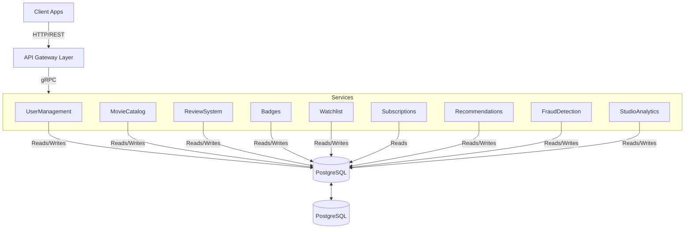

# Cloud Native Application - Phase 3

### Group
Joana Carrasqueira, 64414
Leonor Silva, 59811
Tiago Pereira, 55854
Tiago Pina, 66101

# Functional Requirements

## User Management
### FR. User Registration
- System must allow new users to register with email, password, username and optional parameters (gender, age).
- Password must follow security requirements, such as:
    - at least 15 characters
    - at least one number
    - at least one uppercase letter
    - at least one special character
- Terms and conditions must be accepted.
- System must validate the email and username uniqueness.

### FR. User Authentication
- System must authenticate users with OAuth2.0 or username/email and password.
- System must receive a unique authentication in the token upon OAuth2.0 login.
- If unique id doesn't exist in the system database, system must convert OAuth2.0 login into a profile compatible with the platform.
- System must invalidate OAuth2.0 token on logout.

### FR. User Profile 
- Users must be able to update their profile (username, gender, age).
    -  Username must be unique.
- Users must be able to adjust their preferences.
- Users must be able to delete their account.

## Movie Catalog (UC8,UC9)
### FR. Movie Detail
- System must provide detailed view of a specific movie when requested by its unique identifier (movie ID), including: 
    - title
    - release date
    - list of genres
    - average rating (calculated from user reviews)
    - main cast (list of names)
    - director(s)
    - synopse or description
    - runtime (duration in minutes)
    - parental rating (e.g. PG-13)
    - list of streaming platforms where the movie is currently available
- If the requested movie does not exist, the system must return an error message. (?)

### FR. Movie Search
- System must provide a text search endpoint for users to search for movies using keywords and/or filters.
- System must support filtering by:
    - genre
    - year range (from-to)
    - average rating
    - cast/director name
- Search results must support pagination and sorting by relevance, release date and rating.
- System must handle empty search queries gracefully (e.g., return popular or recently added movies).
- System must log search metrics (most searched terms, most used filters, etc.) for later analysis (can feed into the recommendation system).
- If the query is empty (no terms and no filters), the system must return a list of popular or recently added movies, configurable by administrators.

### FR. Movie List
- System must provide a list of movies with browsing options, including:
    - pagination
    - sorting by title, release date, rating, or popularity
    - filters by genre and year
- The response must include, for each movie: title, poster URL, year, list of genres, and average rating.
- User must be able to click on a movie to access its details.
- The default listing (without filters) must be sorted by descending release date (newest movies first). (?)

### FR. Movie CRUD
- System must allow only authorized administrators to create, read, update, and delete operations on movie entries.
- Movie creation/update must be validate:
    - title must be non-empty
    - release date must be a valid date
    - runtime > 0
    - at least one genre must be selected
    - poster URL must be a valid URL
    - parental rating must be one of the allowed values
- Movie deletion must be logical (soft delete):
    - Logically deleted movies do not appear in searches, listings, or details for regular users.
    - Reviews, ratings, and watchlists associated with deleted movies must be preserved for historical integrity, but not displayed.
- Any changes to movie data should be reflected across the system (e.g., in search, lists, details).

## Review System
### FR. Rating CRUD
- Only authenticated users must be able to submit, edit, or delete thir own reviews. 
- A review must contain a rating (integer from 1 to 10) and an optional text review (max 2000 characters).
- The system must enforce uniqueness: a user can have only one review per movie. If a new review is submitted for the same movie, the previous one is replaced (no version history).
- Editing is only allowed by the review author and must update the updatedAt timestamp. (?)
- Deletion must be physical (hard delete) from the reviews table, but must preserve the movie and user records. (?)
- Upon any rating change (create, update, delete), the system must trigger an asynchronous recalculation of the movie's average rating.

### FR. Ratings List
- System must allow retrieval of all ratings and reviews for a specific movie.
- The list must be:
    - paginated
    - sortable by date, rating, or helpfulness
    - optional filters: only with text, only without text
- For each rating, the system must display:
    - the user (anonymized or username)
    - rating (1-10)
    - review text (if exists)
    - creation/update timestamp
- The system must not list reviews marked as fraudulent for regular users.

### FR. Recalculate Movie Rating
- System must maintain an accurate average rating for each movie based on all submitted ratings.
- Recalculation must be performed asynchronously after each rating change (create, update, or delete) to prevent performance degradation.
- The updated average rating must be stored in the movie catalog database for quick retrieval.
- Only ratings not marked as fraudulent should contribute to the average.
- For movies with many reviews (>1000), the system may update the average approximately to avoid overload, but the final version must be consistent.

## Badges
### FR. CRUD badges (system)
- System must allow administrators to create, read, update and delete badge definitions (e.g., “Explorer”, “Streak Master”).  
- Each badge definition must include at least: unique identifier, title, milestone rule and optional description.  
- System must validate that badge titles are unique across all badge definitions.  
- Deleting a badge definition must not remove historical records of badges already awarded to users, but must prevent the badge from being awarded in the future (up to debate).  

### FR. Award Badges
- System must automatically evaluate user activity (ratings, watchlists, viewing streaks, genre exploration, etc.) to determine when a user meets a badge milestone.  
- When a milestone is met, the system must award the corresponding badge to the user and store the award timestamp.  
- System must expose an operation to manually award or revoke badges for administrative purposes (e.g., correcting errors or running special campaigns).  
- Awarded badges must be visible in the user profile and retrievable via the badges API endpoints.  

### FR. List user badges
- System must allow retrieval of all badges awarded to a specific user, including badge details (title, milestone) and award date.  
- System must support pagination of user badges when a user has a large number of awarded badges.  
- System must support filtering user badges by badge type (e.g., exploration, streak) and by time window (e.g., badges earned in the last 30 days).  

## Watchlists
### FR. Create Watchlist
- Users must be able to create a new watchlist by providing a title.
- Users should be able to add multiple movies to the watchlist after creation.
- The system must validate that the title is not empty.

### FR. Edit Watchlist
- Users must add or remove movies from watchlists.
- Users must be able to rename a watchlist, as long as the new title does not duplicate another watchlist they own.
- The system must prevent adding the same movie twice.

### FR. Delete Watchlist
- Users must be able to delete a watchlist they own.
- Deleting a watchlist must also remove all associated movie entries.
- The system must ensure that only the owner can delete their watchlist.

### FR. Retrieve User Watchlists
- Users must be able to retrieve all their watchlists and their contents.
- Users must be able to retrieve a single watchlist by its ID.
- Users should be able to filter the contents of a watchlist by genre.

## Subscriptions
### FR. Subscribe to plan
- System must allow users to subscribe to a paid plan that unlocks premium features (e.g., advanced analytics, streaming subscription optimizer, early access to new tools) (up to debate).  
- System must support at least one recurring plan (e.g., monthly) and store subscription start date, plan type and current status.  
- System must validate payment or external billing confirmation before activating a subscription.  

### FR. Manage subscription plan
- Users must be able to view their current subscription status, including plan type, renewal date and payment status.  
- Users must be able to upgrade, downgrade or cancel their subscription from within the platform.  
- System must ensure that subscription changes are reflected in access control to premium features without requiring user re‑registration.  

### FR. Premium Access
- System must restrict access to selected premium features (such as detailed dashboards, subscription optimizer and advanced gamification insights) to users with an active premium subscription.  
- For each request to a premium endpoint, the system must validate the user’s subscription status through the Subscriptions service.  
- If the subscription is expired or cancelled, the system must deny access and return an appropriate error, suggesting re‑subscription.  

### FR. CRUD Subscriptions
- System must provide administrative operations to create, read, update and cancel subscriptions for support and correction purposes.  
- System must log all subscription lifecycle events (creation, renewal, cancellation, plan changes) for auditing and billing reconciliation.  
- System must ensure that subscription records remain consistent with the external payment provider, handling asynchronous callbacks or webhooks when necessary in later phases.

## Recommendation
### FR. Initial Profile Recommendations
- New users must be able to select preferred genres and genres to avoid during the registration process.
- New users must be able to search and select 3 to 5 reference movies.
- The system must build a preference vector based on the user's explicit genre choices, reference titles, and similarities with other users.
- The system must generate tailored homepage shelves such as "Based on Your Genres", "Based on Your Favourite Titles" for the user's first session.
- Users must be able to filter these initial recommendations based on the streaming platforms they own.

### FR. Personalized Recommendations
- System must analyze a user’s rating history, preferred genres, and interactions to calculate personalized movie and series recommendations.
- System must order the recommended titles by relevance and probability of user satisfaction.
- System must update recommendations dynamically as the user rates new titles or alters their watchlists.

### FR. Genre Family Exploration
- System must group movies into "genre families" by analyzing genre co-occurrence and overall user consumption patterns.
- System must calculate and categorize each user's consumption into highly explored and underexplored genre families.
- System must generate distinct discovery shelves for the user interface, such as "Comfort Zone" and "Explore Something New"

## Fraud Detection (UC3, UC5)
### FR. Detect Inconsistent Consumption
- System must have a continuous background service that analyzes interaction events (ratings, reviews, views) in time windows (e.g., last 24h, last 7 days).
- Detection rules must be configurable by administrators via interface, including:
    - activity threshold: e.g., more than 20 ratings in 10 minutes
    - new accounts: extreme ratings (1 or 10) from accounts < 7 days old   
    - unusual device or geographic location patterns
    - coordinated behavior across multiple accounts (e.g., same IP address, similar timings)
    - significant deviations from a user's typical behavior profile (viewing times, preferred genres, rating distribution, etc.)
- Detected anomalies must be persisted in a fraud_alerts table with: (?)
    - activated rule type
    - affected entity (ratingId, userId, movieId)
    - timestamp
    - severity (low, medium, high) defined by rule
- The system must support automatic action modes by severity:
    - high severity → automatically quarantine the rating
    - medium severity → send notification to admin
    - low severity → only log for analysis
- System must distinguish between potentially malicious patterns and genuine shifts in taste, using adaptative models where feasible.

### FR. Review Fraud Treatment
- When a rating/review is identified as potentially fraudulent (e.g., part of review bombing), the system must quarantine it:
    - Exclude it from public averages, recommendations, and studio analytics.
    - Store quarantine metadata (reason, timestamp, user)
- Quarantined items must be reviewed by administrators, who can either restore them or permanently mark them as fraudulent.
- The system must maintain a log of all fraud detection events and actions taken.
- When an item is restored, the system must trigger a movie average recalculation event (because it now counts again).

## Studio Analytics
### FR. Sentiment Analysis
- System must automatically process user text reviews using Natural Language Processing (NLP).
- System must classify each processed review into sentiment categories: positive, negative, or neutral.
- System must aggregate these sentiment metrics to calculate an overall sentiment score for each movie or series.

### FR. Topic Extraction
- System must analyze reviews to extract frequently mentioned topics (e.g., plot, acting, special effects, pacing).
- System must generate automated summaries highlighting the most frequent strengths and weaknesses mentioned by the audience.

### Fr. User Cluster Analytics 
- System must group users into distinct segments (clusters) based on consumption history, preferred genres, and usage patterns.
- System must correlate and aggregate the extracted sentiments and topics specific to each user segment (e.g., showing how 'Casual Viewers' vs. 'Cinephiles' reacted to the same movie).

# Application Architecture
## Architecture Diagram

## Architecture Description 
description: 

### API Gateway

### Microservices

| Microservice     | Description                                                                            | Communication |
| ---------------- | -------------------------------------------------------------------------------------- | ------------- |
| User Management  | Includes user admin operations (CRUD), user profiles and user registration             |               |
| Movie Catalog    | Movie CRUD operations, Movie listing and details, as well as movie search with filters |               |
| Review System    | Ratings, reviews and average scores updates                                            |               |
| Badges           | Badge definitions and awarding                                                         |               |
| Watchlists       | Create and manage wathclists                                                           |               |
| Subscriptions    | Subcriptions lifecycle                                                                 |               |
| Recomendation    | Hybrid recommendations, genre families and personalised recommendations                |               |
| Fraud Detection  | Fraud detection, fraud rating treatment                                                |               |
| Studio Analytics | NLP sentiment, topic/tag modeling, dashboards                                          |               |

### Database

### Protocols
- **REST/HTTPS** for all client–server communication
### Deployment