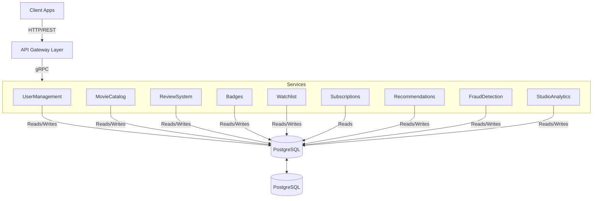

# Cloud Native Application - Phase 3

### Group
Joana Carrasqueira, 64414
Leonor Silva, 59811
Tiago Pereira, 55854
Tiago Pina, 66101

# Functional Requirements

## User Management
### FR. User Registration
- System must allow new users to register with email, password, username and optional parameters (gender, age).
- Password must follow security requirements, such as:
    - at least 15 characters
    - at least one number
    - at least one uppercase letter
    - at least one special character
- Terms and conditions must be accepted.
- System must validate the email and username uniqueness.

### FR. User Authentication
- System must authenticate users with OAuth2.0 or username/email and password.
- System must receive a unique authentication in the token upon OAuth2.0 login.
- If unique id doesn't exist in the system database, system must convert OAuth2.0 login into a profile compatible with the platform.
- System must invalidate OAuth2.0 token on logout.

### FR. User Profile 
- Users must be able to update their profile (username, gender, age).
    -  Username must be unique.
- Users must be able to adjust their preferences.
- Users must be able to delete their account.

## Movie Catalog (UC8,UC9)
### FR. Movie Detail
### FR. Movie Search
### FR. Movie List
### FR. Movie CRUD

## Review System
### FR7. CRUD rating 
### FR. List Ratings
### FR. Recalculate movie rating

## Badges
### FR. CRUD badges (system)
### FR. Award Badges
### FR. List user badges

## Watchlists
### FR8. CRUD Watchlists
### FR. Create Watchlist
### FR. Edit Watchlist
### FR. List User Watchlists

## Subscriptions
### FR. Subscribe to plan
### FR. Manage subscription plan
### FR. Premium Access
### FR. CRUD Subscriptions

## Recommendation
### FR. Initial Profile Recommendations
- New users must be able to select preferred genres and genres to avoid during the registration process.
- New users must be able to search and select 3 to 5 reference movies.
- The system must build a preference vector based on the user's explicit genre choices, reference titles, and similarities with other users.
- The system must generate tailored homepage shelves such as "Based on Your Genres", "Based on Your Favourite Titles" for the user's first session.
- Users must be able to filter these initial recommendations based on the streaming platforms they own.
### FR. Personalized Recommendations
- System must analyze a user’s rating history, preferred genres, and interactions to calculate personalized movie and series recommendations.
- System must order the recommended titles by relevance and probability of user satisfaction.
- System must update recommendations dynamically as the user rates new titles or alters their watchlists.
### FR. Genre Family Exploration
- System must group movies into "genre families" by analyzing genre co-occurrence and overall user consumption patterns.
- System must calculate and categorize each user's consumption into highly explored and underexplored genre families.
- System must generate distinct discovery shelves for the user interface, such as "Comfort Zone" and "Explore Something New"

## Fraud Detection (UC3, UC5)
### FR. Detect Inconsistent Consumption
### FR. Review Fraud Treatment

## Studio Analytics
### FR. Sentiment Analysis
- System must automatically process user text reviews using Natural Language Processing (NLP).
- System must classify each processed review into sentiment categories: positive, negative, or neutral.
- System must aggregate these sentiment metrics to calculate an overall sentiment score for each movie or series.
### FR. Topic Extraction
- System must analyze reviews to extract frequently mentioned topics (e.g., plot, acting, special effects, pacing).
- System must generate automated summaries highlighting the most frequent strengths and weaknesses mentioned by the audience.
### Fr. User Cluster Analytics 
- System must group users into distinct segments (clusters) based on consumption history, preferred genres, and usage patterns.
- System must correlate and aggregate the extracted sentiments and topics specific to each user segment (e.g., showing how 'Casual Viewers' vs. 'Cinephiles' reacted to the same movie).
 

# Application Architecture
## Architecture Diagram

## Architecture Description 
description: 

### API Gateway

### Microservices

| Microservice     | Description                                                                            | Communication |
| ---------------- | -------------------------------------------------------------------------------------- | ------------- |
| User Management  | Includes user admin operations (CRUD), user profiles and user registration             |               |
| Movie Catalog    | Movie CRUD operations, Movie listing and details, as well as movie search with filters |               |
| Review System    | Ratings, reviews and average scores updates                                            |               |
| Badges           | Badge definitions and awarding                                                         |               |
| Watchlists       | Create and manage wathclists                                                           |               |
| Subscriptions    | Subcriptions lifecycle                                                                 |               |
| Recomendation    | Hybrid recommendations, genre families and personalised recommendations                |               |
| Fraud Detection  | Fraud detection, fraud rating treatment                                                |               |
| Studio Analytics | NLP sentiment, topic/tag modeling, dashboards                                          |               |

### Database

### Protocols
- **REST/HTTPS** for all client–server communication
### Deployment