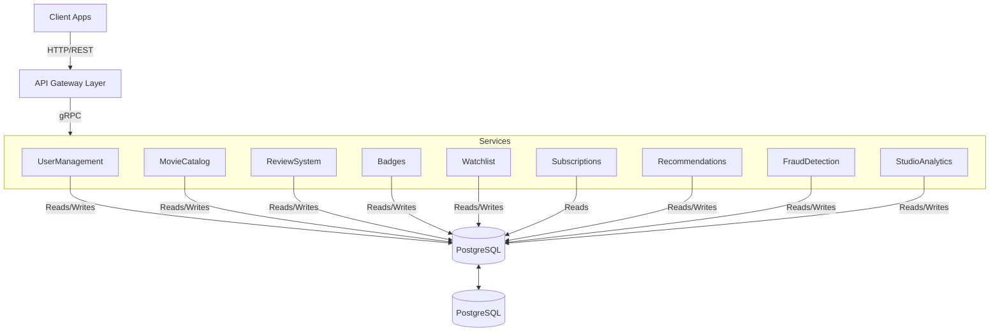

# Cloud Native Application - Phase 3

### Group
Joana Carrasqueira, 64414
Leonor Silva, 59811
Tiago Pereira, 55854
Tiago Pina, 66101

# Functional Requirements

## User Management
### FR1. User Registration
- System must allow new users to register with email, password, username and optional parameters (gender, age).
- Password must follow security requirements, such as:
    - at least 15 characters
    - at least one number
    - at least one uppercase letter
    - at least one special character
- Terms and conditions must be accepted.
- System must validate the email and username uniqueness.

### FR2. User Authentication
- System must authenticate users with OAuth2.0 or username/email and password.
- System must receive a unique authentication in the token upon OAuth2.0 login.
- If unique id doesn't exist in the system database, system must convert OAuth2.0 login into a profile compatible with the platform.
- System must invalidate OAuth2.0 token on logout.

### FR3. User Profile 
- Users must be able to update their profile (username, gender, age).
    -  Username must be unique.
- Users must be able to adjust their preferences.
- Users must be able to delete their account.

## Movie Catalog (UC8,UC9)
### FR. Movie Detail
### FR. Movie Search
### FR. Movie List
### FR. Movie CRUD

## Review System
### FR7. CRUD rating 
### FR. List Ratings
### FR. Recalculate movie rating

## Badges

### FR. CRUD badges (system)
- System must allow administrators to create, read, update and delete badge definitions (e.g., “Explorer”, “Streak Master”).  
- Each badge definition must include at least: unique identifier, title, milestone rule and optional description.  
- System must validate that badge titles are unique across all badge definitions.  
- Deleting a badge definition must not remove historical records of badges already awarded to users, but must prevent the badge from being awarded in the future (up to debate).  

### FR. Award Badges
- System must automatically evaluate user activity (ratings, watchlists, viewing streaks, genre exploration, etc.) to determine when a user meets a badge milestone.  
- When a milestone is met, the system must award the corresponding badge to the user and store the award timestamp.  
- System must expose an operation to manually award or revoke badges for administrative purposes (e.g., correcting errors or running special campaigns).  
- Awarded badges must be visible in the user profile and retrievable via the badges API endpoints.  

### FR. List user badges
- System must allow retrieval of all badges awarded to a specific user, including badge details (title, milestone) and award date.  
- System must support pagination of user badges when a user has a large number of awarded badges.  
- System must support filtering user badges by badge type (e.g., exploration, streak) and by time window (e.g., badges earned in the last 30 days).  

## Watchlists
### FR8. CRUD Watchlists
### FR. Create Watchlist
### FR. Edit Watchlist
### FR. List User Watchlists

## Subscriptions

### FR. Subscribe to plan
- System must allow users to subscribe to a paid plan that unlocks premium features (e.g., advanced analytics, streaming subscription optimizer, early access to new tools) (up to debate).  
- System must support at least one recurring plan (e.g., monthly) and store subscription start date, plan type and current status.  
- System must validate payment or external billing confirmation before activating a subscription.  

### FR. Manage subscription plan
- Users must be able to view their current subscription status, including plan type, renewal date and payment status.  
- Users must be able to upgrade, downgrade or cancel their subscription from within the platform.  
- System must ensure that subscription changes are reflected in access control to premium features without requiring user re‑registration.  

### FR. Premium Access
- System must restrict access to selected premium features (such as detailed dashboards, subscription optimizer and advanced gamification insights) to users with an active premium subscription.  
- For each request to a premium endpoint, the system must validate the user’s subscription status through the Subscriptions service.  
- If the subscription is expired or cancelled, the system must deny access and return an appropriate error, suggesting re‑subscription.  

### FR. CRUD Subscriptions
- System must provide administrative operations to create, read, update and cancel subscriptions for support and correction purposes.  
- System must log all subscription lifecycle events (creation, renewal, cancellation, plan changes) for auditing and billing reconciliation.  
- System must ensure that subscription records remain consistent with the external payment provider, handling asynchronous callbacks or webhooks when necessary in later phases.

## Recommendation
### FR. Initial Profile Recommendations
### FR. Personalized Recommendations
### FR. Genre Family Exploration

## Fraud Detection (UC3, UC5)
### FR. Detect Inconsistent Consumption
### FR. Review Fraud Treatment

## Studio Analytics
### FR. Sentiment Analysis
### FR. Topic Extraction
### Fr. User Cluster Analytics 

# Application Architecture
## Architecture Diagram

## Architecture Description 
description: 

### API Gateway

### Microservices

| Microservice     | Description                                                                            | Communication |
| ---------------- | -------------------------------------------------------------------------------------- | ------------- |
| User Management  | Includes user admin operations (CRUD), user profiles and user registration             |               |
| Movie Catalog    | Movie CRUD operations, Movie listing and details, as well as movie search with filters |               |
| Review System    | Ratings, reviews and average scores updates                                            |               |
| Badges           | Badge definitions and awarding                                                         |               |
| Watchlists       | Create and manage wathclists                                                           |               |
| Subscriptions    | Subcriptions lifecycle                                                                 |               |
| Recomendation    | Hybrid recommendations, genre families and personalised recommendations                |               |
| Fraud Detection  | Fraud detection, fraud rating treatment                                                |               |
| Studio Analytics | NLP sentiment, topic/tag modeling, dashboards                                          |               |

### Database

### Protocols
- **REST/HTTPS** for all client–server communication
### Deployment