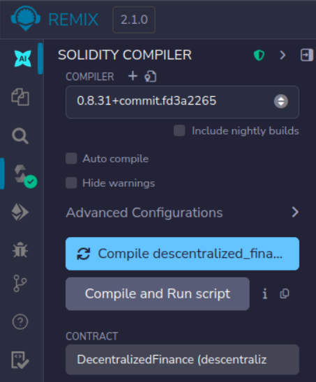
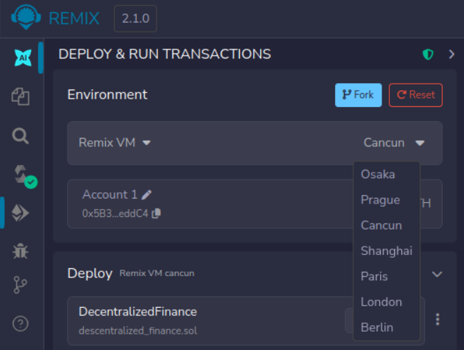
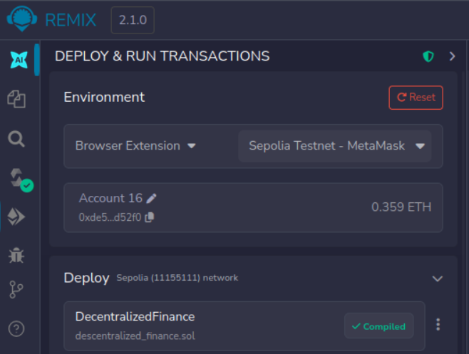
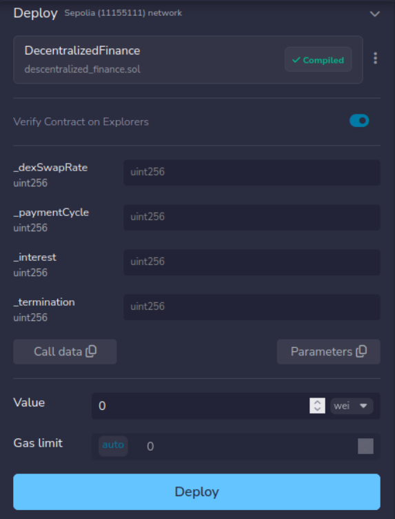

# Decentralized Finance Smart Contract
Decentralized Computing and Blockchains — 2025/26

Group 3 
- Joana Carrasqueira, 64414
- Miguel Marçal, 57542

----

## Project
This project implements a decentralized platform for token swapping and collateralized lending. It utilizes a custom ERC20 token, DEX, to facilitate transactions on the Ethereum blockchain.

## Requirements
To successfully deploy and interact with this contract, ensure you have the following:
- Remix IDE: Access via remix.ethereum.org
- Solidity Compiler: Set to version 0.8.30 or higher
- MetaMask browser extension
- Testnet Funds: SepoliaETH (MetaMask with 2 accounts) ou Remix VM acounts

## Deployment and running the contract
- Create a new file contract named DecentralizedFinance.sol in Remix with the code in file provided.
- Navigate to the Solidity Compiler tab and click Compile DecentralizedFinance.sol:

### Option 1: Remix VM (instant testing)
- **Enviroment:** select REMIX VM, one of the available regions (Cacun, Osaka, etc...)
  

- This uses local simulated accounts with 100 ETH, chose one to be the deploy account (owner of contract)

### Option 2: MetaMask and Sepolia
- **Eviroment:** Browser Extension Sepolia Testnet - MetaMask

- Ensure MetaMask is on Sepolia Test Network
- Set up accounts to be used in remix (needs permissions)
- Use account one to deploy the contract (owner of contract)
- Every operation needs to be approved in MetaMask

### Deployment constructor
- Before clicking deploy, ensure to populate the construstor:

| parameter      | description                                              |
| -------------- | -------------------------------------------------------- |
| *dexSwapRate*  | price of 1 DEX in wei                                    |
| *paymentCycle* | Time between payments in seconds (e.g 180 for 3 minutes) |
| *interest*     | interest rate (e.g 10 for 10%)                           |
| *termination*  | fixed termination fee of loan                            |

- Ensure value doesn't send any value since the constructor is not payable

| parameter      | test values                 |
| -------------- | --------------------------- |
| *dexSwapRate*  | 100 (1 DEX costs 100 Wei)   |
| *paymentCycle* | 30 to 60 (for a rapid test) |
| *interest*     | 10                          |
| *termination*  | 50                          |

### Running contract
- If account the same as the one used in deployment then that account is the owner of the contract, so only in this account can you access checkLoan and getBalance.
   - Switch accounts for other functions 
- Select function to test 
  
#### 1. buyDex()
- Call the function with:
   - Value: 3000 (wei)
- Result: Acount now has 30 DEX (can be checked by calling *getDexBalance()*), and contract has been funded with ETH

### 2. sellDex(dexAmount)
- Call the function with:
   - Value: 0
   - dexAmount: 20 (dex)
- Result: Account now has less 20 DEX and funded with ETH.

### 3. loan(dexAmount, deadline)
- Call the function with:
   - Value: 1 (dex)
   - dexAmount: 3 (cycles)
- Values calculated in loan: 
   - principal = 50 (wei)
   - collateral = 1 (dex)
 - Account receives 50 wei and loanID is 1.

### 4. makePayment(loanID)
- Call the function 3 times:

| **Step**      | **Function**   | **Required msg.value** | **Explanation** |
| ------------- | -------------- | ---------------------- | --------------- |
| **Payment 1** | makePayment(1) | **166 Wei**            | Cycle 1 Interest ($50 \times 10 / 3$) |
| **Payment 2** | makePayment(1) | **166 Wei**            | Cycle 2 Interest                      |
| **Final Pay** | makePayment(1) | **216 Wei**            | Cycle 3 Interest + 50 Wei Principal   |

### 5. terminateLoan(loanID)
- Create another loan - loan(1,5). Then imediatly after call terminateLoan with loanID equal to 2 and value 100 (50 for the loan and 50 for the termination fee).
- Loan is terminated, its state updated (active = false), collateral is sent back to user and termination fee is added to contract balance.

### 6. checkLoan(loanID)
- By sending loanID (value.msg must be zero) at any instance the state of the loan can be observed (in remix variables shown in terminal). 
- State of loan includes:
   - status - msg of status of loan (*Terminated - Collateral Lost, Terminated or Active*)  
   - deadline - deadline of the loan 
   - cycles - the amount of cycles that have been paid 
- checkLoan also ensures collateral is not sent in case the loan is not payed on time.

